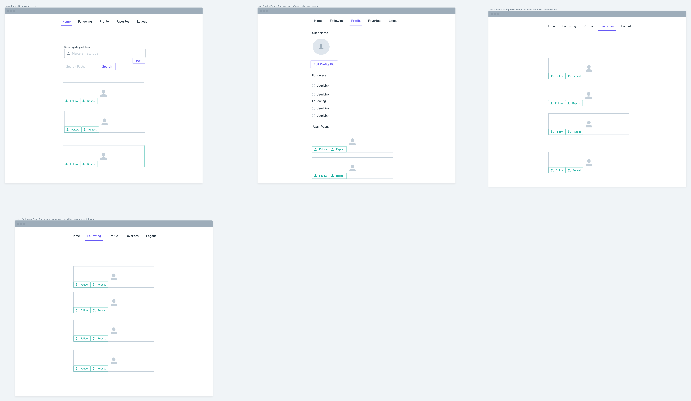

# Approach/Methodology
The core functionality of our app is a user's ability to make posts and interact with posts from other users, so we developed our app with this lens. As a result, we quickly identified that giving a user the ability to view their posts and the ability to toggle between a feed of all posts and a feed of posts from users they follow were important components of the app. To facilitate the following feed, we had to give users the ability to follow/unfollow users.

In terms of building the app, we focused our energies on building the backend first and then building connections from the frontend to the backend. In short, we had to translate the key functionalities we identified in the planning stage into code and define how these functionalities interacted with our backend.

# Landing page after user logs in


# Link to Deployed App
Link to come

# Link to Backend Repo
[Here](https://github.com/SFX818/Team-7-backend) is a link to our backend repo

# Wireframes


# User Stories
| As a user, I want to be able to...|
|-|
|Write a post that is visible to other users|
|Categorize my post using hashtags|
|Follow and unfollow other users |
|Favorite posts|
|Retweet posts|
|Reply to posts|
|View a feed of all posts|
|View a feed of posts from users I follow|
|View other user profiles|
|View my favorited posts|
|Search for topics (hashtags)|

# Frontend Tech Stack
## Fetching Data
- Axios: allows us to make calls to send data to and retrieve data from our backend. We are also investigating integrating a Twitter API into our app.

## Architecture
- React: building our fronted with the React library allows us to break our app down into reusable components, and helps us create a more user friendly experience because we are able to re-render only components whose state has changed without re-rendering other components.

```
App
|
|--Home
|  |--Post(s)
|  |   |--Replies
|  |
|  |--Searchbar
|  |
|  |--PostForm
|
|--Following
|  |--Post(s)
|
|--Favorites
|  |--Post(s)
|
|--UserProfile
|  |--Post(s)
      |--Following

```

## Styling
- Bootstrap

# Installation Instructions
- Fork & clone this repo
- cd into local directory and `npm install` to install dependencies

# Problems/Challenges
- We ran into an issue rendering posts for users a user follows because our data from the backend initially required iterating through a nested array. This resulted in posts displaying from a single user but broke when a user followed multiple users. This was ultimately resolved by reconfiguring a route on the backend and made our code more efficient because it cut out the need for an extra API call and subsequent nested array that came with it.
- Since we did reuse our post component in every page that rendered current and other user's code there was a difference in how every object came through from the backend depending on how we set it up. At first we had to make promises to access the information we needed but ended up populating much of the backend so we could use in the frontend easily.


